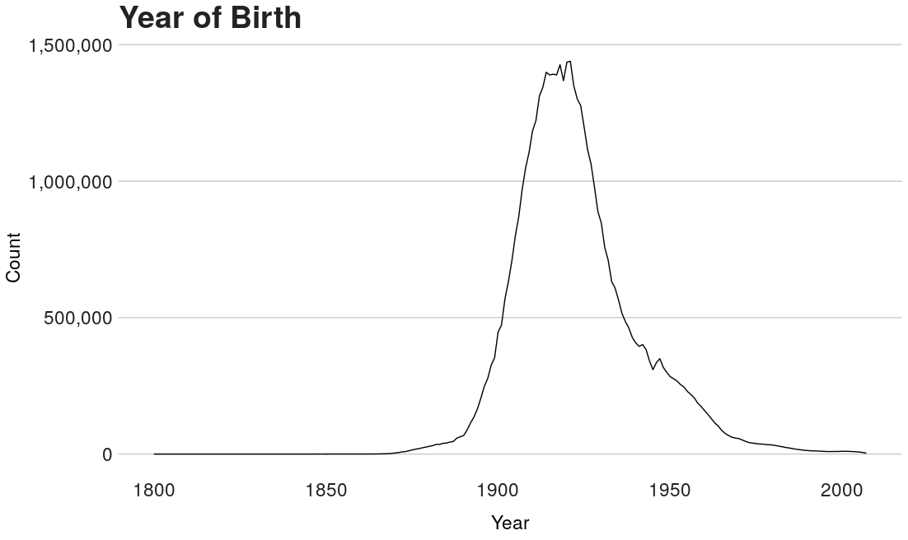
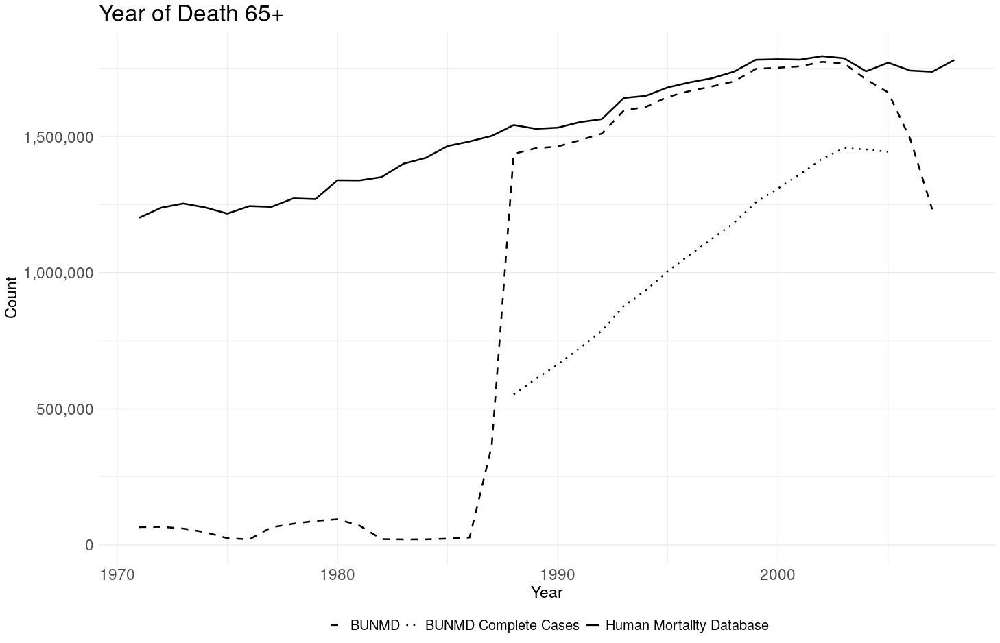
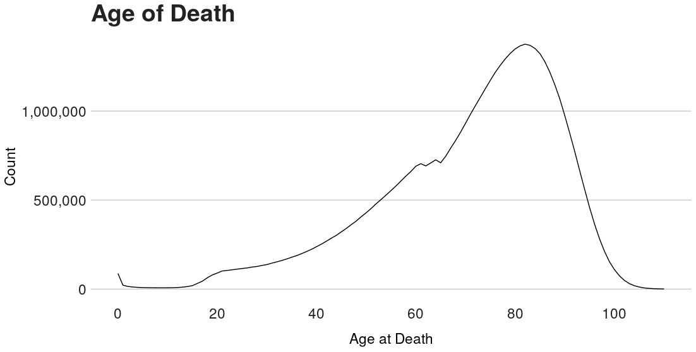
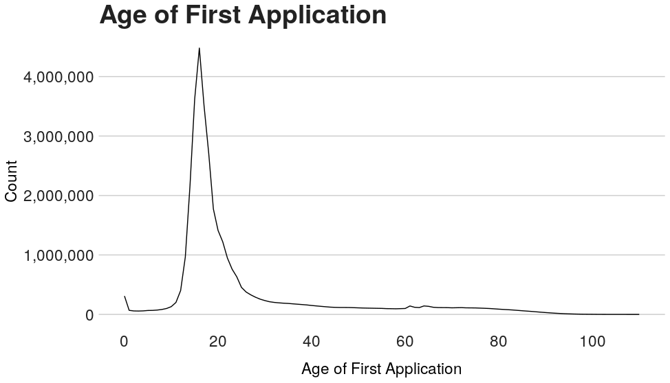
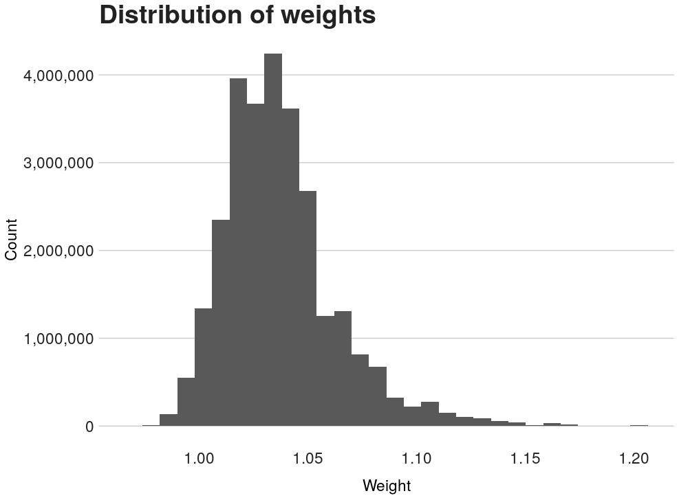
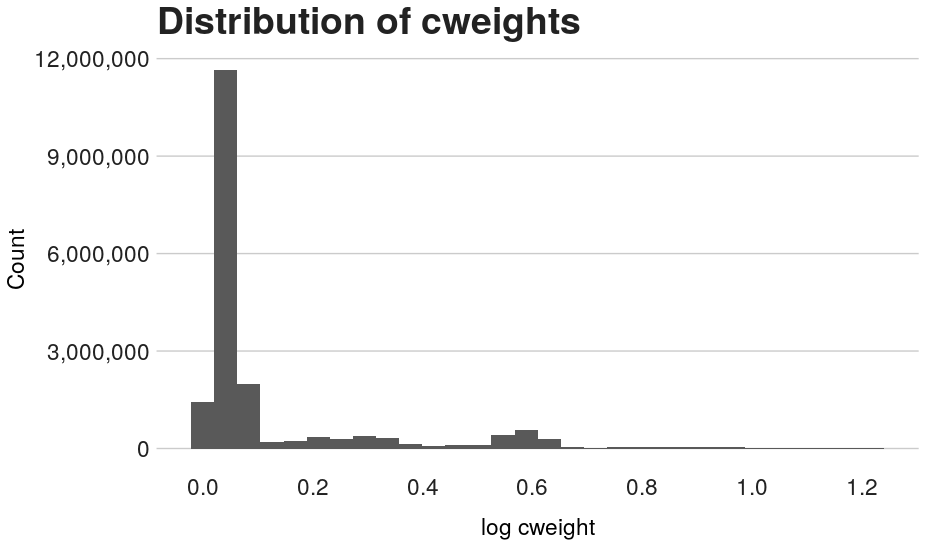

| Page| Variable     | Label                                        |
|----:|:-------------|:---------------------------------------------|
|  2  |ssn           |Social Security Number                        |
|  3  |fname         |First Name                                    |
|  4  |mname         |Middle Name                                   | 
|  5  |lname         |Last Name                                     |
|  6  |sex           |Sex                                           |
|  7  |race_first        |Race on First Application                 |
|  8  |race_first_cyear  |First Race: Application Year              |
|  9  |race_first_cmonth |First Race: Application Month             |
|  10  |race_last         |Race on Last Application                  |
|  11  |race_last_cyear   |Last Race: Application Year               |
|  12  |race_last_cmonth  |Last Race: Application Year               |
|  13 |race_change   |Change in Race Response Flag                  |
|  14 |bpl           |Place of Birth                                |
|  14 |byear         |Year of Birth                                 |
|  15 |bmonth        |Month of Birth                                |
|  16 |bday          |Day of Birth                                  |
|  17 |dyear         |Year of Death                                 |
|  18 |dmonth        |Month of Death                                |
|  19 |dday          |Day of Death                                  |
|  20 |death_age     |Age at Death (Years)                          |
|  21 |zip_residence |ZIP Code of Residence at Time of Death        |
|  22 |socstate      |State where Social Security Number Issued     |
|  23 |father_fname  |Father's First Name                           |
|  24 |father_mname  |Father's Middle Name                          |
|  25 |father_lname  |Father's Last Name                            |
|  26 |mother_fname  |Mother's First Name                           |
|  27 |mother_mname  |Mother's Middle Name                          |
|  28 |mother_lname  |Mother's Last Name                            |
|  29 |age_first_app |Age at First Social Security Application      |
|  30 |number_apps   |Number of Applications                        |
|  31 |number_claims |Number of Claims                              |
|  32 |weight        |High-Coverage Sub-Sample Weight               |
|  33 |cweight       |High-Coverage "Complete" Sub-Sample Weight    |


\newpage 

**\huge ssn**
\normalsize
\vspace{12pt}

**Label**: Social Security Number

**Description**: ssn is 9-character variable corresponding to the person's Social Security number, as recorded in the Numident Death Files. Uniquely identifies all records in the dataset. 

\newpage 

**\huge fname **
\normalsize
\vspace{12pt}

**Label**: First Name

**Description**: fname is a character variable reporting the first 16 letters of the person's first name, as recorded in the Numident Death Files.

\newpage 

**\huge mname **
\normalsize
\vspace{12pt}

**Label:** Middle Name

**Description**: mname is a character variable reporting the first 16 letters of the person's middle name, as recorded in the Numident Death Files.

\newpage 


**\huge lname **
\normalsize
\vspace{12pt}

**Label:** Last Name 

**Description**: lname is a character variable reporting the first 21 letters of the person's last name, as recorded in the Numident Death Files.

\newpage 


**\huge sex **
\normalsize
\vspace{12pt}

**Label:** Sex

**Description**: sex is a numeric variable reporting the person's sex, as recorded in the Numident Death, Application, or Claims Files.

```{r, eval = F, echo = F}
knitr::kable(numident %>%
    group_by(sex) %>%
     tally() %>%
     mutate(freq = signif(n*100 / sum(n), 3)) %>%
     mutate(label = c("Women", "Men", "Missing")) %>%
     select(sex, label, n, freq))
```

| sex|label   |        n|  freq %|
|---:|:-------|--------:|-----:|
|   1|Women   | 25829292| 52.20|
|   2|Men     | 22692883| 45.90|
|  NA|Missing |   937118|  1.89|

\newpage 


**\huge race\_last **
\normalsize
\vspace{12pt}

**Label**: race last

**Description**: race_last is a numeric variable reporting a person's race, as recorded on their most recent application entry.

**Note**: Before 1980, the race schema in the Social Security application form contained three categories: White, Black, and Other. In 1980, the SSA added three categories: (1) Asian, Asian American, or Pacific Islander, (2) Hispanic, and (3) North American Indian or Alaskan Native. They also removed the Other category.

```{r, eval = F, echo = F}
knitr::kable(bunmd %>%
    group_by(race_last) %>%
    tally() %>%
    mutate(freq = signif(n*100 / sum(n), 3)) %>%
    mutate(label = c("White", "Black", "Other", "Asian", "Hispanic", "North American Native", "Missing")) %>%
    select(race, label, n, freq))
```

| race_last|label                 |        n|   freq %|
|---------:|:---------------------|--------:|------:|
|         1|White                 | 28419085| 57.500|
|         2|Black                 |  4040911|  8.170|
|         3|Other                 |   469721|  0.950|
|         4|Asian                 |   305983|  0.619|
|         5|Hispanic              |   794837|  1.610|
|         6|North American Native |    89629|  0.181|
|        NA|Missing               | 15339127| 31.000|

\newpage

**\huge race_last_cyear **
\normalsize
\vspace{12pt}

**Label:** First Race: Application Year

**Description**: race_last_cyear is a numeric variable reporting the year of the application on which a person reported their last race. 

\newpage 

**\Huge race_last_cmonth **
\normalsize
\vspace{12pt}

**Label:** First Race: Application Month

**Description**: race_first_cmonth is a numeric variable reporting the month of the application on which a person reported their first race. This variable is only available for persons who submitted 2 or more applications.

\newpage 

**\huge race\_first **
\normalsize
\vspace{12pt}

**Label**: race first

**Description**: race_first is a numeric variable reporting a person's race, as recorded on their most first application entry. This variable is only available for persons who submitted 2 or more applications.

**Note**: Before 1980, the race schema in the Social Security application form contained three categories: White, Black, and Other. In 1980, the SSA added three categories: (1) Asian, Asian American, or Pacific Islander, (2) Hispanic, and (3) North American Indian or Alaskan Native. They also removed the Other category.

```{r, eval = F, echo = F}
knitr::kable(bunmd %>%
    group_by(race_last) %>%
    tally() %>%
    mutate(freq = signif(n*100 / sum(n), 3)) %>%
    mutate(label = c("White", "Black", "Other", "Asian", "Hispanic", "North American Native", "Missing")) %>%
    select(race, label, n, freq))
```

| race_first|label                 |        n|    freq%|
|----------:|:---------------------|--------:|-------:|
|          1|White                 | 12485938| 25.200|
|          2|Black                 |  2369762|  4.790|
|          3|Other                 |   332058|  0.671|
|          4|Asian                 |    60605|  0.123|
|          5|Hispanic              |   106111|  0.215|
|          6|North American Native |     6833|  0.014|
|         NA|Missing               | 34097986| 68.900|

\newpage

**\huge race_first_cyear **
\normalsize
\vspace{12pt}

**Label:** First Race: Application Year

**Description**: race_first_cyear is a numeric variable reporting the year of the application on which a person reported their first race. This variable is only available for persons who submitted 2 or more applications. 

\vspace{12pt}

\newpage 

**\huge race_first_cmonth **
\normalsize
\vspace{12pt}

**Label:** First Race: Application Month

**Description**: race_first_cmonth is a numeric variable reporting the month of the application on which a person reported their first race. 


\newpage 

**\huge race\_change **
\normalsize
\vspace{12pt}

**Label**: Change in Race Response Flag

**Description**: race_change is a numeric dichotomous variable reporting whether an individual changed their race response across their Social Security Applications.
 
```{r, eval = F, echo = F}
knitr::kable(numident %>%
               group_by(race_change) %>%
               tally() %>%
               mutate(freq = signif(n*100 / sum(n), 3)) %>%
               mutate(label = c("No Change", "Change", "No Race Information")) %>%
               select(race_change, label, n, freq))
```

| race_change|label               |        n|  freq|
|-----------:|:-------------------|--------:|-----:|
|           0|No Race Change      | 33266185| 67.30|
|           1|Race Change         |   855066|  1.73|
|          NA|No Race Information | 15338042| 31.00|

\newpage 


**\huge bpl **
\normalsize
\vspace{12pt}

**Label**: Birthplace

**Description**: bpl is a numeric variable reporting the person's place of birth, as recorded in the Numident Application or Claims Files. The numeric codes match the detailed IPUMS-USA Birthplace codes. 

For a complete list of IPUMS Birthplace codes, please see: https://usa.ipums.org/usa-action/variables/BPL

```{r, echo = F, eval = F}

## Needs to be updated
bpl_cdes <- inner_join(birthplaces, ipums_labels, by = c("bpl" = "Value"))
t1 <- bpl_cdes %>% filter(row_number() < 38)
t2 <- bpl_cdes %>% filter(row_number() >= 38)

knitr::kable(list(t1, t2))
```

\newpage 

**\huge byear **
\normalsize
\vspace{12pt}

**Label**: Birth Year

**Description**: byear is a numeric variable reporting the person's year of birth, as recorded in the Numident Death Files.  

```{r, echo = F, eval = F}
numident %>%
    group_by(byear) %>%
    summarise(n = n()) %>%
    ggplot(aes(x = byear, y = n)) + 
    geom_line() + 
    bbc_style() + #replace with a different theme (theme_bw()) if the bbplot package isn't downloaded 
  ggtitle("Year of Birth") + 
  theme(legend.position="bottom") +
  xlab("title") + 
  theme(axis.title = element_text(size = 17), 
    axis.text.y = element_text(size=17),
    axis.text.x = element_text(size=17)) +
  labs(x = "Year", 
       y = "Count") + 
  scale_y_continuous(labels = comma) + 
  scale_x_continuous(breaks=pretty_breaks(n=5)) 
```

\vspace{75pt}




\newpage 

**\huge bmonth **
\normalsize
\vspace{12pt}

**Label:** Birth Month

Description: bmonth is a numeric variable reporting the person's month of birth, as recorded in the Numident Death Files.   

```{r, eval = F, echo = F}
knitr::kable(numident %>%
    group_by(bmonth) %>%
    tally() %>%
    mutate(freq % = signif(n*100 / sum(n), 2)) %>%
    mutate(label = c("January", "February", "March", "April", "May", "June", "July", "August", "September", "October", "November", "December", "Missing" )) %>%
    select(bmonth, label, n, freq))
```

| bmonth|label     |       n| freq %|
|------:|:---------|-------:|----:|
|      1|January   | 4182362| 8.50|
|      2|February  | 3934481| 8.00|
|      3|March     | 4298094| 8.70|
|      4|April     | 3977247| 8.00|
|      5|May       | 4052332| 8.20|
|      6|June      | 3938073| 8.00|
|      7|July      | 4222150| 8.50|
|      8|August    | 4363897| 8.80|
|      9|September | 4280311| 8.70|
|     10|October   | 4174817| 8.40|
|     11|November  | 3885413| 7.90|
|     12|December  | 4040209| 8.20|
|     NA|Missing   |  109907| 0.22|

\newpage 

**\huge bday **
\normalsize
\vspace{12pt}

**Label**: Birth Day

**Description**: bday is a numeric variable reporting the person's day of birth, as recorded in the Numident Death Files.

**Note:** It appears from the slight surplus of counts on the 1st and the 15th of the month that SSA might have done some imputation of missing values to these dates.


```{r, eval = F, echo = F}
knitr::kable(numident %>%
    group_by(bday) %>%
    tally() %>%
    mutate(freq = signif(n*100 / sum(n), 2)) %>%
    select(bday, n, freq))
```
| bday|       n| freq %|
|----:|-------:|----:|
|    1| 1753037| 3.50|
|    2| 1658636| 3.40|
|    3| 1609604| 3.30|
|    4| 1638344| 3.30|
|    5| 1622429| 3.30|
|    6| 1627081| 3.30|
|    7| 1605454| 3.20|
|    8| 1631946| 3.30|
|    9| 1590718| 3.20|
|   10| 1710732| 3.50|
|   11| 1586416| 3.20|
|   12| 1671226| 3.40|
|   13| 1569174| 3.20|
|   14| 1621411| 3.30|
|   15| 1782797| 3.60|
|   16| 1613405| 3.30|
|   17| 1605213| 3.20|
|   18| 1617172| 3.30|
|   19| 1576992| 3.20|
|   20| 1643737| 3.30|
|   21| 1547095| 3.10|
|   22| 1632108| 3.30|
|   23| 1592781| 3.20|
|   24| 1591696| 3.20|
|   25| 1657974| 3.40|
|   26| 1568795| 3.20|
|   27| 1577768| 3.20|
|   28| 1625137| 3.30|
|   29| 1472251| 3.00|
|   30| 1414617| 2.90|
|   31|  901488| 1.80|
|   NA|  142059| 0.29|

\newpage 

**\huge dyear **
\normalsize
\vspace{12pt}

**Label**: Death Year

**Description**: dyear is a numeric variable reporting the person's year of death, as recorded in the Numident Death Files.   

\vspace{75pt}
\begin{center}
\end{center}
 


```{r, echo = F, eval = F}
hmd_deaths <-  readHMDweb(CNTRY = "USA", item = "Deaths_1x1", username ="caseybreen@berkeley.edu", password = "censoc") %>% mutate(linking_key = paste(Year, Age, sep = "_" ))

numident_deaths_age <- numident %>% 
  filter(death_age >= 65) %>% 
  group_by(Year = dyear) %>% 
  filter(Year > 1960) %>% 
  summarize(deaths = n()) %>% 
  mutate(source = "Numident")

numident_deaths_age_sample1 <- numident %>% 
  filter(death_age >= 65 & !is.na(weight)) %>% 
  group_by(Year = dyear) %>% 
  filter(Year > 1960) %>% 
  summarize(deaths = n()) %>% 
  mutate(source = "Numident Sample 1")

numident_deaths_age_sample2 <- numident %>% 
  filter(death_age >= 65) %>% 
  filter(!is.na(cweight)) %>% 
  group_by(Year = dyear) %>% 
  filter(Year > 1960) %>% 
  summarize(deaths = n()) %>% 
  mutate(source = "Numident Sample 2")


hmd_deaths_age <- hmd_deaths %>%
  filter(Age >= 65) %>% 
  group_by(Year) %>% 
  filter(Year > 1960) %>% 
  summarize(deaths = sum(Total)) %>% 
  mutate(source = "Human Mortality Database")

numident_deaths_age %>% 
  bind_rows(hmd_deaths_age, numident_deaths_age_sample1, numident_deaths_age_sample2) %>% 
  filter(Year > 1970 & Year < 2006) %>% 
ggplot() + 
  geom_line((aes(x = Year, y = deaths, linetype=source))) + 
  bbc_style() + #replace with a different theme (theme_bw()) if the bbplot package isn't downloaded 
  ggtitle("Year of Death (65+)") + 
  theme(legend.position="bottom") +
  xlab("title") + 
  theme(axis.title = element_text(size = 17), 
    axis.text.y = element_text(size=17),
    axis.text.x = element_text(size=17)) +
  labs(x = "Year", 
       y = "Count") + 
  scale_y_continuous(labels = comma) + 
  scale_x_continuous(breaks=pretty_breaks(n=5)) 
```

\newpage 

**\huge dmonth **
\normalsize
\vspace{12pt}

**Label**: Death Month

**Description**: dmonth is a numeric variable reporting the person's month of death, as recorded in the Numident Death Files.  

```{r, echo = F, eval = F}
knitr::kable(numident %>%
    group_by(dmonth) %>%
    tally() %>%
    mutate(freq = signif(n*100 / sum(n), 3)) %>%
    mutate(label = c("January", "February", "March", "April", "May", "June", "July", "August", "September", "October", "November", "December")) %>%
    select(dmonth, label, n, freq))
```


| dmonth|label     |       n| freq %|
|------:|:---------|-------:|----:|
|      1|January   | 4621213| 9.34|
|      2|February  | 4129166| 8.35|
|      3|March     | 4364385| 8.82|
|      4|April     | 4046639| 8.18|
|      5|May       | 4033845| 8.16|
|      6|June      | 3838325| 7.76|
|      7|July      | 3934370| 7.95|
|      8|August    | 3896991| 7.88|
|      9|September | 3844745| 7.77|
|     10|October   | 4136177| 8.36|
|     11|November  | 4112452| 8.31|
|     12|December  | 4500985| 9.10|

\newpage 

**\huge dday **
\normalsize
\vspace{12pt}

**Label**: Day of Death

**Description**: dday is a numeric variable reporting the person's day of death, as recorded in the Numident Death Files.  

**Note:** It appears from the slight surplus of counts on the 1st and the 15th of the month that SSA might have done some imputation of missing values to these dates.


```{r, echo = F, eval = F}
knitr::kable(numident %>%
    group_by(dday) %>%
    tally() %>%
    mutate(freq = signif(n*100 / sum(n), 2)) %>%
    select(dday, n, freq))
```

| dday|       n| freq %|
|----:|-------:|----:|
|    1| 1432117|  2.9|
|    2| 1240844|  2.5|
|    3| 1258508|  2.5|
|    4| 1281971|  2.6|
|    5| 1241858|  2.5|
|    6| 1238126|  2.5|
|    7| 1234530|  2.5|
|    8| 1237355|  2.5|
|    9| 1234153|  2.5|
|   10| 1236855|  2.5|
|   11| 1234082|  2.5|
|   12| 1234552|  2.5|
|   13| 1230166|  2.5|
|   14| 1231018|  2.5|
|   15| 3392923|  6.9|
|   16| 1227380|  2.5|
|   17| 1228029|  2.5|
|   18| 1223497|  2.5|
|   19| 1223840|  2.5|
|   20| 1230608|  2.5|
|   21| 1218730|  2.5|
|   22| 1217331|  2.5|
|   23| 1219357|  2.5|
|   24| 1216437|  2.5|
|   25| 1214086|  2.5|
|   26| 1216349|  2.5|
|   27| 1215884|  2.5|
|   28| 1217907|  2.5|
|   29| 1130914|  2.3|
|   30| 1104859|  2.2|
|   31|  713928|  1.4|
|   NA| 9681099| 20.0|

\newpage 

**\huge death\_age **
\normalsize
\vspace{12pt}

**Label**: Age at Death (Years)

**Description**: death_age is a numeric variable reporting the person's age at death in years, calculated using birth and death information recorded in the Numident Death Files.   

\vspace{50pt}



```{r, echo = F, eval = F}
numident %>%
  filter(death_age %in% c(0:110)) %>% 
    group_by(death_age) %>%
    summarise(n = n()) %>%
    ggplot(aes(x = death_age, y = n)) + 
    geom_line() + 
    bbc_style() + #replace with a different theme (theme_bw()) if the bbplot package isn't downloaded 
  ggtitle("Age of Death") + 
  theme(legend.position="bottom") +
  xlab("title") + 
  theme(axis.title = element_text(size = 17), 
    axis.text.y = element_text(size=17),
    axis.text.x = element_text(size=17)) +
  labs(x = "Age at Death", 
       y = "Count") + 
  scale_y_continuous(labels = comma) + 
  scale_x_continuous(breaks=pretty_breaks(n=5)) 


```


\newpage 

**\huge zip\_residence **

\normalsize

\vspace{12pt}

**Label**: ZIP Code of Residence at Time of Death

**Description**: zip_residence is 9-character variable reporting a person's ZIP code of residence at time of death, as  in the Numident Death Files. 

\newpage 
**\huge socstate **

\normalsize

\vspace{12pt}

**Label**: State where Social Security Number Issued

**Description**: The state in which the person's social security card was issued. Determined by first three (3) digits of Social Security number, as recorded in Numident Files. The numeric codes match the detailed IPUMS-USA Birthplace codes. 

```{r, eval = F, echo = F}
state_fip_codes <- fread("/nobackup/90days/andreamg/state_fips_ipums.csv")

knitr::kable(numident %>%
    group_by(socstate) %>%
    tally() %>%
    mutate(freq = signif(n*100 / sum(n), 3)) %>%
    left_join(state_fip_codes, by = c("socstate" = "ipums_state" )) %>%
    select(socstate, label = state_label, n, freq))

```


| socstate|label                |       n|    freq %| socstate|label                |       n|    freq %|
|--------:|:--------------------|-------:|-------:|--------:|:--------------------|-------:|-------:|
|        100|Alabama              | 1013114|  2.0500|       3000|Montana              |  163772|  0.331|
|        200|Alaska               |   35314|  0.0714|       3100|Nebraska             |  391529|  0.792|
|        400|Arizona              |  259482|  0.5250|       3200|Nevada               |   59603|  0.121|
|        500|Arkansas             |  622464|  1.2600|       3300|New Hampshire        |  154722|  0.313|
|        600|California           | 3261932|  6.6000|       3400|New Jersey           | 1515988|  3.070|
|        800|Colorado             |  436618|  0.8830|       3500|New Mexico           |  152197|  0.308|
|        900|Connecticut          |  645960|  1.3100|       3600|New York             | 5000225| 10.100|
|       1000|Delaware             |  104140|  0.2110|       3800|North Dakota         |  181787|  0.368|
|       1100|District of Columbia |  298806|  0.6040|       3900|Ohio                 | 2465058|  4.980|
|       1200|Florida              | 1045741|  2.1100|       4000|Oklahoma             |  781455|  1.580|
|       1300|Georgia              | 1174645|  2.3700|       4100|Oregon               |  424431|  0.858|
|       1500|Hawaii               |  165481|  0.3350|       4200|Pennsylvania         | 3275278|  6.620|
|       1600|Idaho                |  179614|  0.3630|       4400|Rhode Island         |  253020|  0.512|
|       1700|Illinois             | 2860175|  5.7800|       4500|South Carolina       |  640174|  1.290|
|       1800|Indiana              | 1250160|  2.5300|       4600|South Dakota         |  174948|  0.354|
|       1900|Iowa                 |  766774|  1.5500|       4700|Tennessee            | 1117541|  2.260|
|       2000|Kansas               |  581153|  1.1800|       4800|Texas                | 2568121|  5.190|
|       2100|Kentucky             |  919569|  1.8600|       4900|Utah                 |  208837|  0.422|
|       2200|Louisiana            |  901320|  1.8200|       5000|Vermont              |  111228|  0.225|
|       2300|Maine                |  283787|  0.5740|       5100|Virginia             | 1016994|  2.060|
|       2400|Maryland             |  730409|  1.4800|       5300|Washington           |  676778|  1.370|
|       2500|Massachusetts        | 1468915|  2.9700|       5400|West Virginia        |  526125|  1.060|
|       2600|Michigan             | 2037662|  4.1200|       5500|Wisconsin            | 1023189|  2.070|
|       2700|Minnesota            |  820184|  1.6600|       5600|Wyoming              |   86937|  0.176|
|       2800|Mississippi          |  607037|  1.2300|       NA  |NA                   | 2716291|  5.490|
|       2900|Missouri             | 1302609|  2.6300|           |                     |        |        |


\newpage 


**\huge father\_fname **
\normalsize
\vspace{12pt}

**Label**: Father's First Name

**Description**: father_fname is a character variable reporting the first 16 letters of the person's father's first name, as recorded in the Numident Death Files.

\newpage 

**\huge father\_mname **
\normalsize
\vspace{12pt}

**Label**: Father's Middle Name

**Description**: father_mname is a character variable reporting the first 16 letters of the person's father's middle name, as recorded in the Numident Death Files.

\newpage 


**\huge father\_lname **
\normalsize
\vspace{12pt}

**Label**: Father's Last Name 

**Description**: father_lname is a character variable reporting the first 21 letters of the person's father's last name, as recorded in the Numident Death Files.

\newpage 


**\huge mother\_fname **
\normalsize
\vspace{12pt}

**Label**: Mother's First Name

**Description**: mother_fname is a character variable reporting the first 16 letters of the person's mother's first name, as recorded in the Numident Death Files.

\newpage 

**\huge mother\_mname **
\normalsize
\vspace{12pt}

**Label**: Mother's Middle Name

**Description**: mother_mname is a character variable reporting the first 16 letters of the person's mother's last name, as recorded in the Numident Death Files.

\newpage 


**\huge mother\_lname **
\normalsize
\vspace{12pt}

**Label**: Mother's Last Name 

**Description**: mother_lname is a character variable reporting the first 21 letters of the person's mother's middle name, as recorded in the Numident Death Files.

\newpage 

**\huge age\_first\_app **

\normalsize

\vspace{12pt}

**Label**: Age at First Social Security Application 

**Description**: age_first_app reports the age at which the person submitted their first Social Security Application. 

```{r, echo = F, eval = F}
numident %>%
    group_by(age_first_application) %>%
    filter(age_first_application %in% c(0:110)) %>% 
    summarise(n = n()) %>%
    ggplot(aes(x = age_first_application, y = n)) + 
    geom_line() + 
    bbc_style() + #replace with a different theme (theme_bw()) if the bbplot package isn't downloaded 
  ggtitle("Age of First Application") + 
  theme(legend.position="bottom") +
  xlab("title") + 
  theme(axis.title = element_text(size = 17), 
    axis.text.y = element_text(size=17),
    axis.text.x = element_text(size=17)) +
  labs(x = "Age of First Application", 
       y = "Count") + 
  scale_y_continuous(labels = comma) + 
  scale_x_continuous(breaks=pretty_breaks(n=5)) 


```

\vspace{50pt}



\newpage 

**\huge number\_apps **

\normalsize

\vspace{12pt}

**Label**: Total Number of Applications 

**Description**: number_apps reports the person's total number of Social Security applications, as recorded in the Numident Application Files. 


```{r, eval = F, echo = F}
topcode <- function(a, top) { 
    return(ifelse(a > top, top, a))
}

knitr::kable(numident %>%
    mutate(number_apps = topcode(number_apps, 10)) %>%         
    group_by(number_apps) %>%
    tally() %>%
    mutate(freq = signif(n*100 / sum(n), 2)) %>%
    select(number_apps, n, freq))
```
| number_apps|        n|   freq|
|-----------:|--------:|------:|
|           0| 14284609| 29.000|
|           1| 17649245| 36.000|
|           2| 10108410| 20.000|
|           3|  4310000|  8.700|
|           4|  1710599|  3.500|
|           5|   719303|  1.500|
|           6|   323112|  0.650|
|           7|   155221|  0.310|
|           8|    80363|  0.160|
|           9|    43690|  0.088|
|          10+|    74741|  0.150|


\newpage 

**\huge number\_claims **

\normalsize

\vspace{12pt}

**Label**: Total Number of Claims 

**Description**: number_claims reports the person's total number of Social Security claims, as recorded in the Numident Claim Files. 


```{r, eval = F, echo = F}
topcode <- function(a, top) { 
    return(ifelse(a > top, top, a))
}

knitr::kable(numident %>%
    mutate(number_claims = topcode(number_claims, 3)) %>%         
    group_by(number_claims) %>%
    tally() %>%
    mutate(freq = signif(n*100 / sum(n), 2)) %>%
    select(number_claims, n, freq))
```

| number_claims|        n|   freq|
|-------------:|--------:|------:|
|             0| 32933624| 66.587|
|             1| 16478755| 33.318|
|             2|    45788|  0.093|
|             3+|     1126|  0.002|

\newpage 

**\huge weight**

\normalsize

\vspace{12pt}

**Label**: High Coverage Sample Weight

**Description**: A post-stratification person-weight to Human Mortality Database (HMD) totals for persons (1) born between 1900-1940 (2) dying between 1988-2005 and (3) a recorded sex. Please see appendix for more details on weighting procedure. 

```{r, eval = F, echo = F}
numident %>%
    ggplot() + 
    geom_histogram(aes(x = weight)) + 
    bbc_style() + #replace with a different theme (theme_bw()) if the bbplot package isn't downloaded 
  ggtitle("Distribution of weights") + 
  theme(legend.position="bottom") +
  theme(axis.title = element_text(size = 17), 
    axis.text.y = element_text(size=17),
    axis.text.x = element_text(size=17)) +
  labs(x = "Weight", 
       y = "Count") + 
  scale_y_continuous(labels = comma) + 
  scale_x_continuous(breaks=pretty_breaks(n=5)) 
```


\vspace{50pt}



\newpage 


**\huge cweight**

\vspace{12pt}

**Label**: High Coverage "Complete" Sample Weight

**Description**: A post-stratification person-weight to Human Mortality Database (HMD) totals for persons (1) born between 1900-1940 (2) dying between 1988-2005 (3) a recorded sex (4) recorded birth place and (5) recorded race. Please see appendix for more details on weighting procedure.

```{r, eval = F, echo = F}
numident %>%
  mutate(cweight_log = log(cweight, base = 10)) %>% 
    ggplot() + 
    geom_histogram(aes(x = cweight_log)) + 
    bbc_style() + #replace with a different theme (theme_bw()) if the bbplot package isn't downloaded 
  ggtitle("Distribution of cweights") + 
  theme(legend.position="bottom") +
  theme(axis.title = element_text(size = 17), 
    axis.text.y = element_text(size=17),
    axis.text.x = element_text(size=17)) +
  labs(x = "log cweight", 
       y = "Count") + 
  scale_y_continuous(labels = comma) + 
  scale_x_continuous(breaks=pretty_breaks(n=5)) + 
  scale_y_log10()
```

\vspace{50pt}


